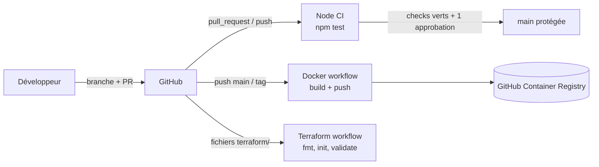

# DevOps Platform Challenge

Application Node.js (Express) utilisée pour mettre en place un workflow DevOps complet :
**Issue → Branche → Code → Pull Request → Review → Approbation → Merge → CI → Container → Package → Validation d'infrastructure**.

## Objectif du projet

- Corriger un défaut dans une application Node.js grâce aux tests.
- Travailler en équipe avec GitHub (issues, branches, PR, reviews, protection de `main`).
- Automatiser les tests, la construction d'une image Docker et la validation Terraform avec GitHub Actions.

## Architecture



### Structure du dépôt

```text
.
├── src/app.js                  # Application Express
├── test/                       # Tests (node:test)
├── terraform/                  # Configuration Terraform (sans cloud)
├── Dockerfile                  # Image multi-stage, utilisateur non-root
├── .dockerignore
├── .github/
│   ├── ISSUE_TEMPLATE/         # Templates bug / feature
│   ├── pull_request_template.md
│   ├── CODEOWNERS
│   └── workflows/
│       ├── node-ci.yml
│       ├── docker.yml
│       └── terraform.yml
└── CONTRIBUTING.md             # Stratégie de branches
```

## API

| Méthode | Route | Description |
|---|---|---|
| GET | `/` | Statut du service |
| GET | `/health` | Healthcheck |
| GET | `/total` | Calcul d'un total (`calculateTotal`) |
| GET | `/tasks` | Liste des tâches |
| POST | `/tasks` | Créer une tâche (`{ "title": "..." }`) |
| PATCH | `/tasks/:id` | Marquer une tâche comme terminée (`{ "completed": true }`) |
| DELETE | `/tasks/:id` | Supprimer une tâche (204 / 404) |

## Installation locale

Prérequis : Node.js 20 LTS, Git, Docker Desktop (optionnel).

```bash
git clone https://github.com/<owner>/<repo>.git
cd <repo>
npm install
npm start        # http://localhost:3000
```

## Tests

```bash
npm test         # node --test
npm run lint     # ESLint
```

Les tests ne doivent jamais être supprimés ou affaiblis pour faire passer la CI.

## Docker

```bash
docker build -t devops-platform-challenge .
docker run --rm -p 3000:3000 devops-platform-challenge
```

L'image est construite en deux étapes (dépendances de production puis image finale) et s'exécute avec l'utilisateur non-root `node`.

Image publiée : `ghcr.io/<owner>/<repo>` (tags `latest`, `sha-xxxxxxx` et tags Git `v*`).

## CI/CD

| Workflow | Déclencheur | Actions |
|---|---|---|
| `node-ci.yml` | PR et push sur `main` | checkout, Node 20, `npm ci`, `npm test` |
| `docker.yml` | PR (build seul), push sur `main`, tags `v*` | build, login GHCR avec `GITHUB_TOKEN`, tags, push |
| `terraform.yml` | Changements dans `terraform/**` | `fmt -check`, `init`, `validate` |

### Protection de `main`

- Pull Request obligatoire, au moins 1 approbation.
- Check CI `test` obligatoire avant le merge.
- Pas de contournement, y compris pour les administrateurs.

## Terraform

Aucun fournisseur cloud n'est connecté. Le dossier `terraform/` contient une configuration minimale (variables, valeur locale, sorties) validée uniquement en CI :

```bash
cd terraform
terraform fmt -check
terraform init -backend=false
terraform validate
```

## Workflow de développement

1. Créer une issue (template bug ou feature).
2. Créer une branche depuis `main` : `feature/...`, `fix/...` ou `chore/...`.
3. Coder, tester en local (`npm test`), commiter avec des messages clairs.
4. Ouvrir une PR avec le template et `Closes #n`.
5. Un autre membre relit et approuve ; la CI doit être verte.
6. Merge dans `main`.

Détails dans [CONTRIBUTING.md](CONTRIBUTING.md).

## Commandes utiles

```bash
git checkout -b feature/ma-feature      # nouvelle branche
git push -u origin feature/ma-feature   # premier push
git fetch origin && git rebase origin/main
npm ci                                  # installation reproductible
docker run --rm devops-platform-challenge whoami   # vérifie le non-root
```

## Équipe

| Membre | Responsabilité initiale |
|---|---|
| Étudiant 1 | Workflow GitHub, issues, templates, protection de `main` |
| Étudiant 2 | Défaut Node.js, tests, Node CI |
| Étudiant 3 | Docker et pipeline conteneur |
| Étudiant 4 | Pipeline Terraform et documentation |